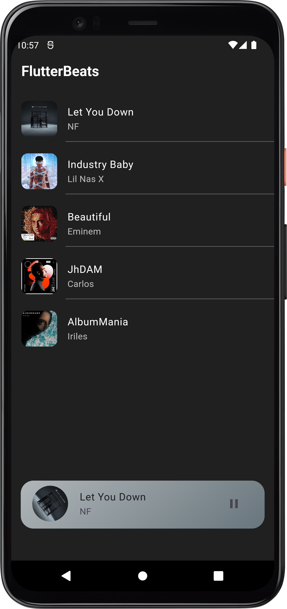
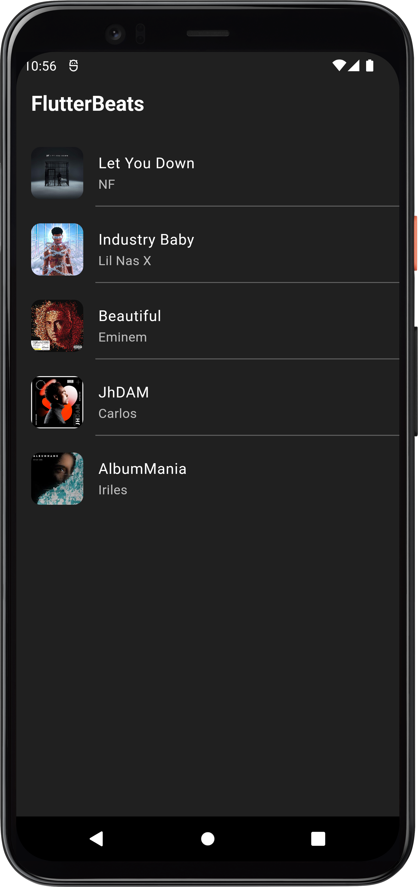
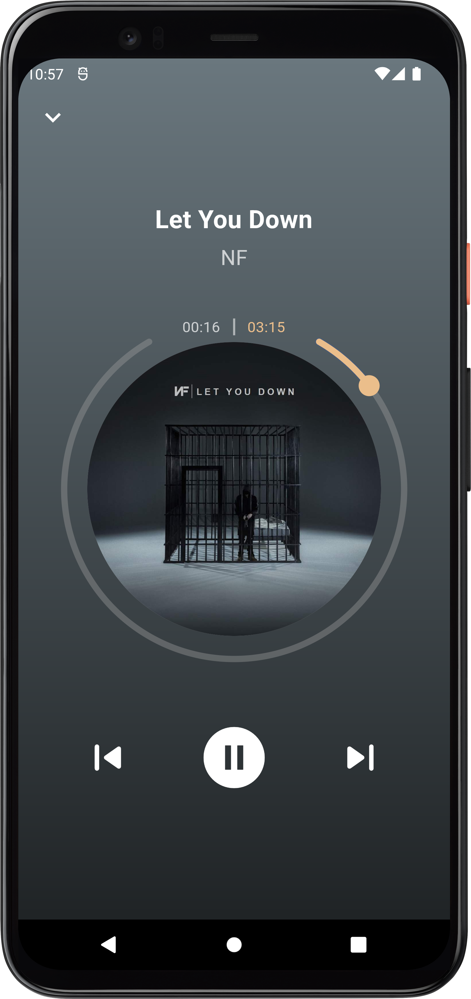

# Flutter Music Player

Welcome to the Flutter Music Player, a beautifully designed and feature-rich music player app built with Flutter. Whether you're a music enthusiast, a casual listener, or a developer looking to explore Flutter's capabilities, this music player offers an immersive audio experience and serves as an excellent example of what can be achieved with Flutter.

## Features

- **Sleek User Interface**: Enjoy a visually appealing and user-friendly design that enhances the overall listening experience.
- **Offline Music**: Play music from your local storage with ease.
- **Custom Playlists**: Create and manage your playlists to organize your music collection.
- **Smooth Playback Controls**: Control playback with smooth animations and user-friendly controls.
- **Shuffle and Repeat**: Shuffle your music for a surprising listening experience, or repeat your favorite tracks.
- **Search and Filter**: Quickly find your desired songs with the search and filter functionalities.
- **Equalizer**: Fine-tune your audio with an in-app equalizer for a personalized listening experience.
- **Album and Artist View**: Explore your music collection by album or artist for a comprehensive view.
- **Lyrics**: Enjoy synchronized lyrics while listening to your favorite tracks.
- **Mini Player**: A convenient mini player allows you to control your music without leaving your current screen.
- **Background Playback**: Continue listening even when the app is running in the background.
- **Flutter Goodness**: Discover the power and flexibility of Flutter in a real-world application.

## Screenshots

<p align="center">
  <table>
    <tr>
      <td style="padding-right: 20">
        
      </td>
      <td>
        
      </td>
      <td>
        
      </td>
    </tr>
  </table>
</p>

## Getting Started

To explore the Flutter Music Player, follow these simple steps:

1. Clone this repository to your local machine.
   ```shell
   git clone https://github.com/your-username/flutter-music-player.git
   ```

2. Navigate to the project directory.
   ```shell
   cd flutter-music-player
   ```

3. Install the necessary dependencies using Flutter's package manager, **pub**.
   ```shell
   flutter pub get
   ```

4. Run the app on a connected device or emulator.
   ```shell
   flutter run
   ```

Begin your musical journey with the Flutter Music Player and dive into the world of Flutter development while enjoying your favorite tunes.

## Contributing

Contributions to the Flutter Music Player are welcome and encouraged! If you find any bugs, have feature requests, or want to contribute in any other way, please open an issue or submit a pull request. Your help can make this music player even better.

## License

This project is licensed under the [MIT License](LICENSE). Feel free to use and modify the code to create your own unique music player.

## Acknowledgements

We extend our gratitude to the Flutter community for their continuous support and the developers of the libraries and packages used in this app.

If you have any questions, suggestions, or need further assistance, please feel free to contact us. Enjoy the music! 🎵🎶
